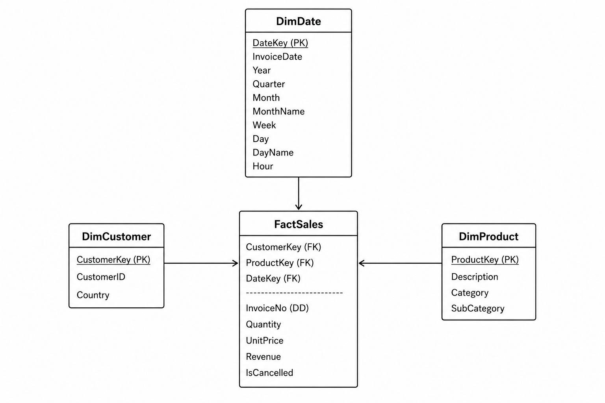

# Online Retail Data Warehouse

## Project Overview

This project designs and implements a dimensional data warehouse for an online retail dataset containing over 1 million transaction records.

The objective was to transform a denormalised transactional dataset into a star schema that supports analytical reporting, business intelligence, and scalable querying.

## Source Dataset

**Dataset:** Online Retail Dataset (UCI Machine Learning Repository)

The source data contains transaction-level information including:

- Customer information
- Product information
- Order information
- Revenue metrics
- Transaction timestamps

The original data has been cleaned and transformed. Details of transformation process [here]([url](https://github.com/awojidetola/uci-analytics-project))

---


## Dimensional Model

A star schema was implemented. The image below contains more details of the schema design. 



### Design Decisions
- Surrogate keys were introduced for all dimensions to create stable relationships between dimensions and the fact table.

- Business identifiers such as: CustomerID were retained within dimensions for business reporting and traceability.

- InvoiceNo was retained directly within the fact table as a degenerate dimension because it represents a transactional identifier without additional descriptive attributes.

- During modelling, an investigation revealed that 13 customers appeared with multiple countries within the dataset period. For this dataset, **the country field** represents where the customer **resides**
This raised a Slowly Changing Dimension discussion regarding customer location history. However, an SCD Type 1 is applied because a Type 2 Implementation was not required for the analytical objectives of this project.


---

## Project Structure

```text
.
├── README.md
├──schema_design.png
├── sql/
│   ├── dim_customer.sql
│   ├── dim_product.sql
│   ├── dim_date.sql
│   └── fact_sales.sql│

```

---
